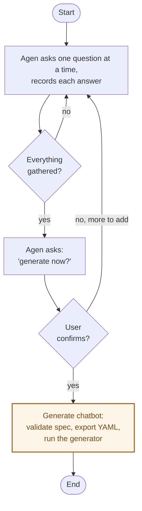

Agen loops through one question at a time until everything's gathered, then asks a human to confirm before it generates anything.

The amber step only runs after an explicit human yes — nothing generates on Agen's own judgment.
