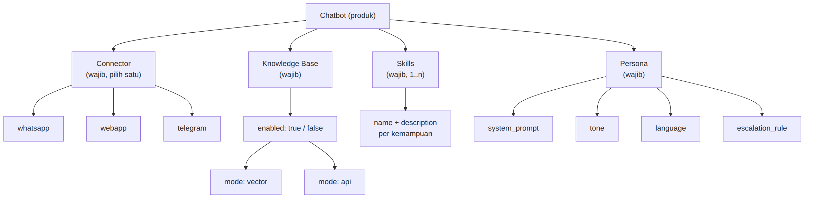
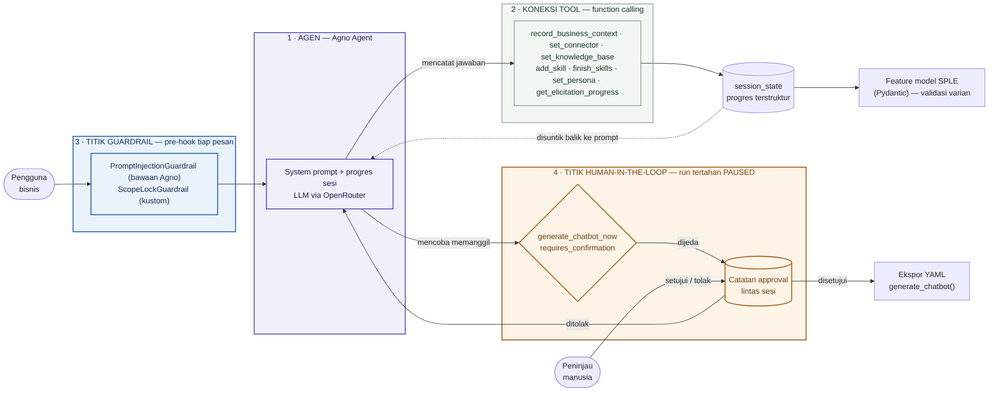
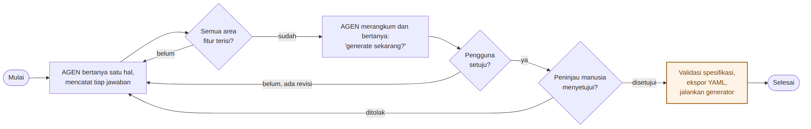
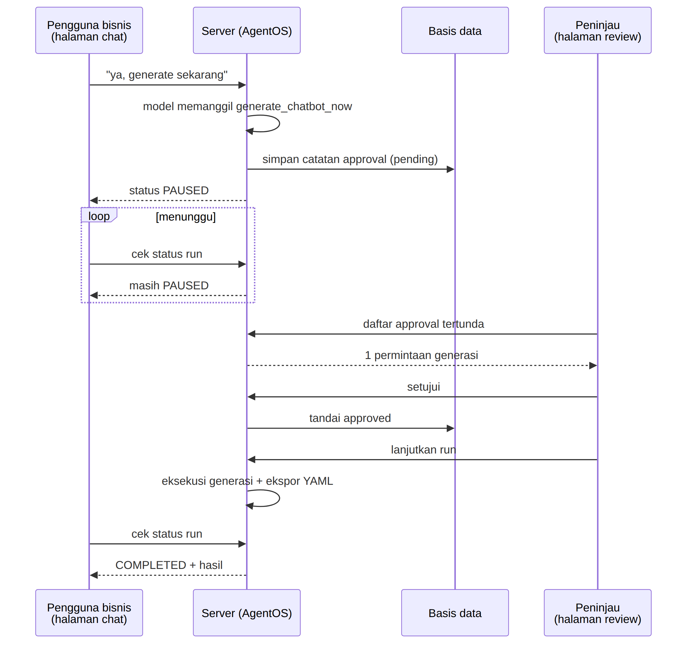

# 3. Desain Sistem

## 3.1 Prinsip perancangan

Sistem dirancang di atas satu prinsip: **LLM dipakai untuk menerjemahkan, bukan untuk mengingat atau mengambil keputusan berisiko.** LLM unggul memahami maksud pengguna dari bahasa bebas, tetapi lemah dalam menjaga konsistensi ingatan pada percakapan panjang dan dalam menentukan kapan aksi berdampak nyata boleh dijalankan. Dua kelemahan itu ditangani secara struktural:

| Kelemahan LLM | Penanganan |
|---|---|
| Kehilangan jejak apa yang sudah dibahas | Status elicitation disimpan di luar model, dalam `session_state` terstruktur |
| Merangkum ulang percakapan dengan risiko melenceng | Spesifikasi dibangun deterministik oleh kode, bukan oleh model |
| Menjalankan aksi berisiko atas penilaian sendiri | Gerbang *human-in-the-loop* pada tingkat eksekusi |

## 3.2 Feature model

Empat area fitur wajib, masing-masing dengan *variation point* tertutup.

**Gambar 1.** *Feature model* AGEN.

AGEN hanya menggali **varian mana** yang dipilih. Detail implementasi sudah ditetapkan SPLE dan dikonfigurasi lewat dashboard terpisah.

| Area fitur | Digali AGEN | Ranah dashboard |
|---|---|---|
| Connector | WhatsApp / WebApp / Telegram | API key, token bot, *phone number ID* |
| Knowledge base | Aktif atau tidak; mode *vector* / *api* | Vector DB, model *embedding*, dokumen sumber |
| Skills | Nama dan deskripsi kemampuan | Implementasi *handler* |
| Persona | Nama, gaya bicara, bahasa, eskalasi | — |

Pemisahan ini juga menjaga agar kredensial tidak pernah melewati percakapan dengan LLM.

## 3.3 Arsitektur sistem

**Gambar 2.** Diagram arsitektur sistem — menunjukkan agen, koneksi tool, titik guardrail, dan titik human-in-the-loop.

Empat titik yang ditandai pada diagram:

| No. | Titik | Isi | Peran |
|---|---|---|---|
| 1 | **Agen** | *System prompt* + progres sesi, LLM via OpenRouter | Menerjemahkan bahasa bisnis ke varian fitur |
| 2 | **Koneksi tool** | Tujuh *tool* pencatat, dipanggil lewat *function calling* | Menulis tiap jawaban ke `session_state` |
| 3 | **Titik guardrail** | `PromptInjectionGuardrail`, `ScopeLockGuardrail` | *Pre-hook* yang memeriksa tiap pesan sebelum mencapai model |
| 4 | **Titik human-in-the-loop** | `generate_chatbot_now` + catatan approval | Menahan run pada status `PAUSED` sampai ada keputusan manusia |

Secara lapisan, keempat titik tersebut mengelompok sebagai berikut:

| Lapisan | Isi | Tanggung jawab |
|---|---|---|
| Percakapan | Agen elicitor, *guardrails*, *recording tools*, `session_state` | Menggali kebutuhan dan mencatatnya |
| Domain | *Feature model* Pydantic | Menegakkan varian yang sah |
| Kendali | Gerbang HITL, ekspor YAML, generator | Menjalankan aksi setelah disetujui manusia |

Arah aliran pada diagram menegaskan dua hal. Pertama, tidak ada jalur dari pengguna ke agen yang melewati titik guardrail — pemeriksaan terjadi sebagai *pre-hook*, bukan sebagai imbauan di dalam *prompt*. Kedua, satu-satunya jalur menuju eksekusi generator melewati catatan approval, sehingga agen tidak memiliki jalur langsung ke aksi berdampak nyata.

## 3.4 Alur elicitation

**Gambar 3.** Alur elicitation hingga generasi.

Terdapat **dua** titik persetujuan yang berbeda sifatnya. Persetujuan pertama bersifat percakapan (pengguna menjawab "ya"), dan masih mungkin salah dinilai model. Persetujuan kedua bersifat struktural, dijamin oleh mekanisme framework dan tidak dapat dilewati model dengan cara apa pun.

## 3.5 Gerbang human-in-the-loop

Fungsi generasi ditandai sebagai *tool* yang memerlukan konfirmasi. Ketika model memanggilnya, eksekusi ditahan, status *run* menjadi `PAUSED`, dan catatan persetujuan ditulis ke basis data. Akibatnya antarmuka chat dan antarmuka peninjau dapat dipisahkan sepenuhnya.

**Gambar 4.** Interaksi antara halaman chat, server, dan halaman peninjau.

Kedua antarmuka tidak pernah berkomunikasi langsung; keduanya hanya bertemu pada satu *run* yang tertahan di sisi server. Tidak ada jalur pada antarmuka chat yang dapat melewati persetujuan, karena persetujuan terjadi di luar kendali halaman tersebut.
