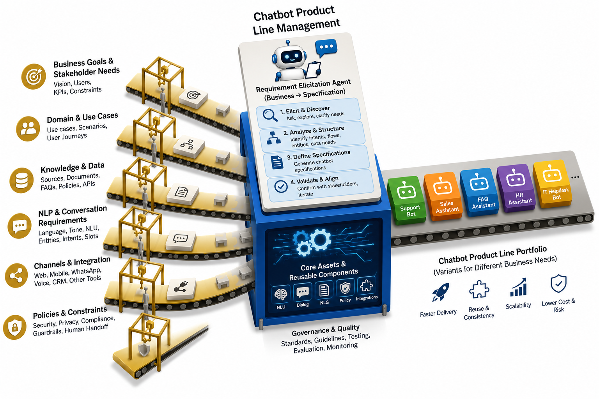

# AGEN: An Agent Generator

## Abstrak

Chatbot sudah menjadi gimmick satu instansi sebagai upaya untuk mengikuti tren di jaman sekarang. Beberapa instansi berhasil mengelola chatbot sebagaimana aplikasi tersebut diperuntukkan, namun sebagai developer hal ini menjadi monoton dan menjadi sebuah rutinitas yang berulang-ulang. Di sisi lain, seorang *business person* sudah mengetahui bagaimana dan apa yang mereka inginkan dari chatbot yang mereka butuhkan namun masih sulit untuk menerjemahkan kebutuhan itu ke dalam istilah teknis yang dapat dimengerti oleh sistem. Di sini adalah peluang besar untuk memanfaatkan AI sebagai translator *business requirements* ke dalam *software specification*. AGEN: An Agent Generator adalah sebuah agen AI yang berusaha untuk menerjemahkan *business requirements* dengan cara berdialog dengan user dengan bahasa awam yang lebih dimengerti oleh users. Alih-alih menanyakan spesifikasi aplikasi seperti chatbot tradisional, penggunaan *Large Language Model* (LLM) mengizinkan interaksi lebih natural namun spesifikasi chatbot tetap didapatkan dengan aturan teknis yang lebih rapi. Penggunaan paradigma *Software Product Line Engineering* (SPLE) juga membuat sistem otomatis dari pelanggan ke produk secara lebih terpercaya. Penerapan konsep ini diharapkan dapat membuat komunikasi antara developer dan user agar lebih efisien dengan tetap memberikan software yang terpercaya.

## 1. Pendahuluan

Penggunaan chatbot sudah semakin meluas hampir di semua organisasi. Mulai dari sebuah chatbot yang bisa menjawab FAQ dalam satu organisasi tersebut, hingga sebuah agen yang bisa menangani komplain dari customer. Hal ini kemudian berdampak pada permintaan pengembangan chatbot yang dipersonalisasi semakin besar. Oleh sebab itu, pengembangan chatbot perlu diperhatikan untuk mengkomersialkan chatbot dalam berbagai kebutuhan.

Pengembangan dengan cara tradisional, sebagai contoh dengan metode Sprint atau Scrum sudah banyak digunakan untuk men-*deliver* aplikasi dengan cepat namun masih terpercaya (*reliable*). Hanya saja, metode-metode tersebut masih berfokus untuk membangun satu aplikasi saja, dimana spesifikasi software, *test case* dan *quality control* ditujukan pada satu domain tertentu. Sehingga, jika software yang sama akan diterapkan pada domain berbeda, proses tersebut akan dilakukan kembali. Hal ini menjadikan tugas *developing software* menjadi monoton dan berulang-ulang. Untuk membuat software yang lebih efisien dengan skala besar dan dengan menggunakan resource yang optimal, *Software Product Line Engineering* (SPLE) diperkenalkan sebagai upaya untuk membuat software yang lebih efisien namun tetap reliable.

Dengan efisiensi dan reliabilitas dari SPLE, aplikasi seperti chatbot juga dapat dimodelkan menggunakan paradigma tersebut. Sehingga produksi aplikasi dapat digunakan dalam skala lebih besar.

## 2. Software Product Line Engineering

*Software Product Line Engineering* (SPLE) merupakan pendekatan pengembangan perangkat lunak yang mengadopsi konsep *product line*, yaitu menghasilkan berbagai produk yang memiliki karakteristik dan kebutuhan berbeda, tetapi dibangun dari sekumpulan komponen dan fitur inti yang sama. Analogi sederhananya seperti sebuah lini produksi kendaraan, satu pabrik dapat menghasilkan berbagai model mobil dengan memanfaatkan mesin, rangka, dan komponen dasar yang sama, kemudian mengkonfigurasinya sesuai kebutuhan konsumen. Dalam SPLE, komponen dan fitur yang dapat digunakan kembali tersebut disebut *core assets*, sedangkan setiap perangkat lunak yang dihasilkan merupakan produk yang dikonfigurasi berdasarkan kebutuhan tertentu. Dengan demikian, SPLE memungkinkan pengembangan berbagai produk perangkat lunak secara lebih cepat, konsisten, dan efisien melalui penggunaan kembali aset serta pengelolaan variasi yang sistematis.

Konsep SPLE dapat diterapkan pada pengembangan chatbot dengan memandang chatbot sebagai bagian dari *software product line*, di mana berbagai chatbot memiliki kebutuhan dan karakteristik yang berbeda, tetapi tetap dapat dibangun dari sekumpulan fitur dan komponen inti yang sama. Berdasarkan konsep tersebut, dibutuhkan suatu mekanisme yang mampu mengidentifikasi kebutuhan pengguna serta memetakan kebutuhan tersebut ke fitur dan variasi chatbot yang tersedia. Salah satu pendekatan yang dapat digunakan adalah *elicitation agent* AGEN: An Agent Generator, yaitu agen berbasis kecerdasan buatan yang berinteraksi dengan pengguna untuk menggali kebutuhan bisnis secara sistematis melalui percakapan. Hasil dari proses *elicitation* kemudian diterjemahkan menjadi spesifikasi chatbot, seperti tujuan chatbot, target pengguna, *use case*, kemampuan, persona, integrasi, serta konfigurasi fitur yang diperlukan. Dengan demikian, AGEN berperan sebagai penghubung antara kebutuhan bisnis pengguna dan proses pembentukan produk chatbot dalam kerangka *Chatbot Product Line Engineering*.



**Gambar 1.** Posisi AGEN dalam *Chatbot Product Line Engineering*: kebutuhan bisnis di sisi masukan diolah oleh *requirement elicitation agent* menjadi spesifikasi, lalu dirakit dengan *core assets* menjadi berbagai varian produk chatbot.

## 3. Desain Sistem

### 3.1 Prinsip perancangan

Sistem dirancang di atas satu prinsip: **LLM dipakai untuk menerjemahkan, bukan untuk mengingat atau mengambil keputusan berisiko.** LLM unggul memahami maksud pengguna dari bahasa bebas, tetapi lemah dalam menjaga konsistensi ingatan pada percakapan panjang dan dalam menentukan kapan aksi berdampak nyata boleh dijalankan. Dua kelemahan itu ditangani secara struktural:

| Kelemahan LLM | Penanganan |
|---|---|
| Kehilangan jejak apa yang sudah dibahas | Status elicitation disimpan di luar model, dalam `session_state` terstruktur |
| Merangkum ulang percakapan dengan risiko melenceng | Spesifikasi dibangun deterministik oleh kode, bukan oleh model |
| Menjalankan aksi berisiko atas penilaian sendiri | Gerbang *human-in-the-loop* pada tingkat eksekusi |

### 3.2 Feature model

Empat area fitur wajib, masing-masing dengan *variation point* tertutup.


**Gambar 2.** *Feature model* AGEN.

AGEN hanya menggali **varian mana** yang dipilih. Detail implementasi sudah ditetapkan SPLE dan dikonfigurasi lewat dashboard terpisah.

| Area fitur | Digali AGEN | Ranah dashboard |
|---|---|---|
| Connector | WhatsApp / WebApp / Telegram | API key, token bot, *phone number ID* |
| Knowledge base | Aktif atau tidak; mode *vector* / *api* | Vector DB, model *embedding*, dokumen sumber |
| Skills | Nama dan deskripsi kemampuan | Implementasi *handler* |
| Persona | Nama, gaya bicara, bahasa, eskalasi | — |

Pemisahan ini juga menjaga agar kredensial tidak pernah melewati percakapan dengan LLM.

### 3.3 Arsitektur sistem


**Gambar 3.** Diagram arsitektur sistem — menunjukkan agen, koneksi tool, titik guardrail, dan titik human-in-the-loop.

| No. | Titik | Isi | Peran |
|---|---|---|---|
| 1 | **Agen** | *System prompt* + progres sesi, LLM via OpenRouter | Menerjemahkan bahasa bisnis ke varian fitur |
| 2 | **Koneksi tool** | Tujuh *tool* pencatat, lewat *function calling* | Menulis tiap jawaban ke `session_state` |
| 3 | **Titik guardrail** | `PromptInjectionGuardrail`, `ScopeLockGuardrail` | *Pre-hook* sebelum pesan mencapai model |
| 4 | **Titik human-in-the-loop** | `generate_chatbot_now` + catatan approval | Menahan run `PAUSED` sampai ada keputusan manusia |

Secara lapisan, keempat titik tersebut mengelompok sebagai berikut.

| Lapisan | Isi | Tanggung jawab |
|---|---|---|
| Percakapan | Agen elicitor, *guardrails*, *recording tools*, `session_state` | Menggali kebutuhan dan mencatatnya |
| Domain | *Feature model* Pydantic | Menegakkan varian yang sah |
| Kendali | Gerbang HITL, ekspor YAML, generator | Menjalankan aksi setelah disetujui manusia |

### 3.4 Alur elicitation


**Gambar 4.** Alur elicitation hingga generasi.

Terdapat **dua** titik persetujuan yang berbeda sifatnya. Persetujuan pertama bersifat percakapan (pengguna menjawab "ya"), dan masih mungkin salah dinilai model. Persetujuan kedua bersifat struktural, dijamin oleh mekanisme framework dan tidak dapat dilewati model dengan cara apa pun.

### 3.5 Gerbang human-in-the-loop

Fungsi generasi ditandai sebagai *tool* yang memerlukan konfirmasi. Ketika model memanggilnya, eksekusi ditahan, status *run* menjadi `PAUSED`, dan catatan persetujuan ditulis ke basis data. Akibatnya antarmuka chat dan antarmuka peninjau dapat dipisahkan sepenuhnya.


**Gambar 5.** Interaksi antara halaman chat, server, dan halaman peninjau.

Kedua antarmuka tidak pernah berkomunikasi langsung; keduanya hanya bertemu pada satu *run* yang tertahan di sisi server. Tidak ada jalur pada antarmuka chat yang dapat melewati persetujuan, karena persetujuan terjadi di luar kendali halaman tersebut.

## 4. Implementasi

### 4.1 Teknologi

| Komponen | Teknologi | Peran |
|---|---|---|
| Framework agen | Agno | Konstruksi agen, *tool calling*, *session state*, HITL |
| Penyedia LLM | OpenRouter | Akses model bahasa |
| Lapisan HTTP | AgentOS (`agno.os`) | REST untuk agen dan API persetujuan |
| Validasi | Pydantic v2 | Penegakan *feature model* |
| Penyimpanan | SQLite | Sesi dan catatan persetujuan |
| Manajemen proyek | uv | Dependensi dan eksekusi |

### 4.2 Struktur modul

```
agent/
  feature_model.py             # model domain SPLE (Pydantic) — sumber kebenaran
  state.py                     # bentuk progres elicitation
  tools.py                     # tool pencatat jawaban ke session state
  generation_tool.py           # generate_chatbot_now — tool yang dijaga HITL
  guardrails.py                # guardrail prompt-injection + scope-lock
  elicitor.py                  # konstruksi Agno Agent
  yaml_export.py               # ChatbotSpec -> berkas YAML
  config.py                    # konfigurasi environment
  prompts/
    elicitor_system_prompt.md  # system prompt, terpisah dari kode
main.py                        # antarmuka CLI
demo/
  server.py                    # aplikasi AgentOS: chat + review
  static/chat.html             # antarmuka pengguna bisnis
  static/review.html           # antarmuka peninjau
```

### 4.3 Penegakan feature model

Aturan variasi ditegakkan sistem tipe, bukan kepatuhan model.

```python
class ConnectorType(str, Enum):
    WHATSAPP = "whatsapp"
    WEBAPP = "webapp"
    TELEGRAM = "telegram"

class KnowledgeBaseFeature(BaseModel):
    enabled: bool = True
    mode: KnowledgeBaseMode | None = None

    @model_validator(mode="after")
    def mode_required_when_enabled(self):
        if self.enabled and self.mode is None:
            raise ValueError("mode wajib diisi ketika knowledge base aktif")
        return self

class ChatbotSpec(BaseModel):
    business_name: str
    connector: ConnectorFeature
    knowledge_base: KnowledgeBaseFeature
    skills: list[ChatbotSkill] = Field(..., min_length=1)
    persona: PersonaFeature
```

Konfigurasi yang melanggar aturan SPLE, misalnya knowledge base aktif tanpa mode atau chatbot tanpa satu pun *skill*, ditolak sebelum YAML terbentuk.

### 4.4 Pelacakan status elicitation

Pada iterasi awal, agen dibiarkan menyimpulkan sendiri area mana yang sudah dibahas dari transkrip. Pendekatan ini gagal pada percakapan panjang: setelah pembahasan berpindah ke persona, agen kembali menanyakan hal yang sudah dijawab pada bagian *skills*. Perbaikannya bukan memperhalus *prompt*, melainkan memindahkan kebenaran status keluar dari model.

```python
def add_skill(run_context: RunContext, name: str, description: str) -> str:
    run_context.session_state["skills"].append(
        {"name": name, "description": description}
    )
    return f"Skill '{name}' dicatat."
```

Status terkini disuntikkan kembali ke *system prompt* setiap giliran melalui substitusi *placeholder*:

```markdown
- business name: {business_name}
- connector: {connector_type}
- knowledge base: enabled={kb_enabled}, mode={kb_mode}
- skills recorded: {skills}
- skills finalized: {skills_done}
```

Model tidak perlu mengingat apa pun; ia selalu membaca catatan eksplisit.

### 4.5 Pembentukan spesifikasi

Spesifikasi dibangun langsung dari `session_state` oleh kode biasa, tanpa melibatkan LLM.

```python
def build_spec_from_state(state: dict[str, Any]) -> ChatbotSpec:
    return ChatbotSpec(
        business_name=state.get("business_name"),
        connector=ConnectorFeature(type=state.get("connector_type")),
        knowledge_base=KnowledgeBaseFeature(
            enabled=bool(state.get("kb_enabled")),
            mode=state.get("kb_mode"),
        ),
        skills=[ChatbotSkill(**s) for s in state.get("skills", [])],
        persona=PersonaFeature(...),
    )
```

Contoh keluaran:

```yaml
business_name: Kopi Senja
connector:
  type: whatsapp
knowledge_base:
  enabled: true
  mode: vector
skills:
  - name: Menjawab pertanyaan menu
    description: Menjelaskan daftar minuman, harga, dan ketersediaan stok harian.
  - name: Menerima pesanan
    description: Mencatat pesanan pelanggan beserta waktu pengambilan.
persona:
  name: Senja
  system_prompt: >-
    Kamu adalah Senja, asisten dari Kopi Senja. Jawab pertanyaan pelanggan
    seputar menu dan pesanan dengan ramah dan singkat. Gunakan bahasa
    Indonesia yang santai. Jika pelanggan menanyakan keluhan atau hal di
    luar menu dan pesanan, arahkan ke staf melalui nomor kedai.
  tone: ramah dan santai
  language: id
  escalation_rule: Alihkan ke staf jika ada keluhan atau permintaan di luar menu.
```

### 4.6 Gerbang HITL

`requires_confirmation=True` menahan eksekusi dan menjeda *run*; `@approval` menuliskan catatan persetujuan ke basis data saat penjedaan terjadi.

```python
@approval
@tool(requires_confirmation=True)
def generate_chatbot_now(run_context: RunContext) -> str:
    state = run_context.session_state
    if not is_complete(state):
        return "Belum lengkap — masih ada informasi yang harus digali."
    spec = build_spec_from_state(state)
    yaml_path = export_spec_to_yaml(spec)
    generate_chatbot(yaml_path)
    return f"Generasi chatbot dimulai dari {yaml_path}."
```

Catatan persetujuan inilah yang memungkinkan peninjau menemukan permintaan tertunda dari **seluruh sesi** dengan satu `GET /approvals?status=pending`, tanpa perlu mengetahui identitas sesi lebih dahulu.

### 4.7 Penyajian dua antarmuka

Lapisan HTTP memakai `AgentOS` bawaan Agno, sehingga protokol *run/pause/continue* dan API persetujuan berasal langsung dari framework.

| Endpoint | Pemakai | Fungsi |
|---|---|---|
| `POST /agents/agen/runs` | Halaman chat | Mengirim pesan |
| `GET /agents/agen/runs/{run_id}` | Halaman chat | Memantau status *run* |
| `GET /approvals?status=pending` | Halaman review | Mendaftar permintaan lintas sesi |
| `POST /approvals/{id}/resolve` | Halaman review | Menyetujui / menolak |
| `POST /agents/agen/runs/{run_id}/continue` | Halaman review | Melanjutkan *run* |

Catatan teknis: AgentOS mendaftarkan `GET /` miliknya sendiri dan memenangkan konflik jalur secara bawaan, sehingga rute halaman chat pada `/` akan diabaikan tanpa peringatan. Hal ini diatasi dengan membangun rute antarmuka pada aplikasi FastAPI tersendiri lalu menyerahkannya ke AgentOS sebagai `base_app` dengan kebijakan `preserve_base_app`.

### 4.8 Guardrails

Setiap pesan pengguna melewati dua lapis pemeriksaan sebelum mencapai model: `PromptInjectionGuardrail` bawaan Agno untuk pola *prompt injection* umum, dan `ScopeLockGuardrail` untuk menolak upaya mengalihkan AGEN dari perannya. Keduanya adalah pertahanan lapis pertama, bukan jaminan tunggal — jaminan sesungguhnya tetap pada gerbang HITL yang bekerja pada tingkat eksekusi.

### 4.9 Hasil pengujian

Alur diverifikasi melalui endpoint HTTP sesungguhnya, dengan LLM digantikan *stub* agar tidak bergantung layanan eksternal.

| Tahap | Hasil diharapkan | Status |
|---|---|---|
| Pesan chat dikirim | Balasan berasal dari agen | Sesuai |
| Model memanggil fungsi generasi | `PAUSED`, fungsi tidak dieksekusi | Sesuai |
| Peninjau membuka daftar | Permintaan terlihat tanpa session id | Sesuai |
| Halaman chat memantau | Tetap `PAUSED` | Sesuai |
| Peninjau menyetujui dan melanjutkan | Berlanjut hingga `COMPLETED` | Sesuai |
| Halaman chat memantau kembali | Menerima hasil akhir | Sesuai |

## 5. Penutup

AGEN menunjukkan bahwa pemanfaatan LLM dalam otomasi pembangunan perangkat lunak tidak harus berupa penyerahan kendali menyeluruh. Model bahasa ditempatkan terbatas sebagai penerjemah antara bahasa bisnis dan ruang varian yang telah ditetapkan *domain engineering*, sementara penyimpanan status, validasi spesifikasi, dan keputusan menjalankan aksi berdampak nyata tetap ditangani mekanisme deterministik dan manusia. Kombinasi keluwesan percakapan di sisi masukan dan ketatnya *feature model* di sisi keluaran inilah yang membuat elicitation terasa alami bagi pengguna bisnis tanpa mengorbankan keterpercayaan spesifikasi.

Pengembangan lanjutan dapat diarahkan pada perluasan *feature model*, penggantian `generate_chatbot()` yang masih berupa *stub* dengan generator sesungguhnya, penambahan otentikasi pada antarmuka peninjau, serta evaluasi empiris dengan pengguna bisnis sebenarnya.

## Referensi

1. Pohl, K., Böckle, G., & van der Linden, F. (2005). *Software Product Line Engineering: Foundations, Principles, and Techniques*. Springer.
2. Clements, P., & Northrop, L. (2001). *Software Product Lines: Practices and Patterns*. Addison-Wesley.
3. Kang, K. C., Cohen, S. G., Hess, J. A., Novak, W. E., & Peterson, A. S. (1990). *Feature-Oriented Domain Analysis (FODA) Feasibility Study*. Software Engineering Institute, Carnegie Mellon University.
